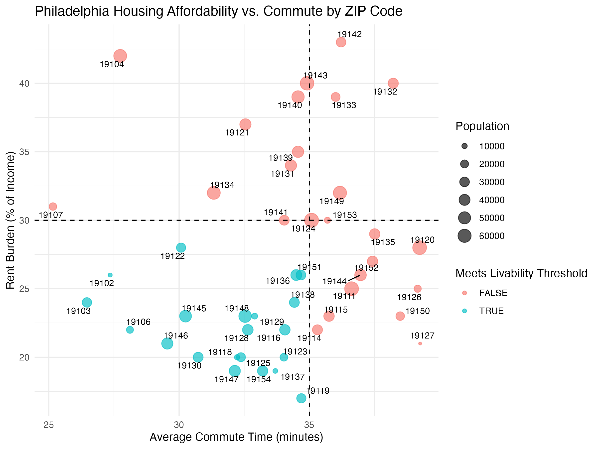

# Rent Affordability and Commute Trade-Offs in Philadelphia

## Overview

Housing affordability and commute time are two major factors influencing where people choose to live in large cities.
This project analyzes Philadelphia ZIP-code–level data to identify neighborhoods that provide the best balance between **affordable rent** and **reasonable commute duration**.

The analysis is intended to demonstrate how data can support **urban planning, housing policy, and relocation decision-making**.

---

## Business Question

**Which Philadelphia ZIP codes face the highest housing affordability risk when considering rent burden, median income, and commute time?**

---

## Data Sources

* U.S. Census / American Community Survey (ACS) neighborhood-level data
* Median rent, median income, population, and commute duration by ZIP code

All datasets were cleaned, standardized, and merged into a single analysis-ready table.

---

## Tools and Skills Demonstrated

* R for data cleaning, transformation, and analysis
* DuckDB / SQL for querying and aggregation
* Data wrangling and feature engineering
* Exploratory data analysis (EDA)
* Data visualization using ggplot2
* Reproducible analytical workflow

---

## Methodology

**1. Data Cleaning and Integration**

* Standardized column names and data formats across sources
* Handled missing or inconsistent ZIP-code coverage
* Merged datasets into one unified table for analysis

**2. Metric Construction**

* Calculated **rent burden** as a percentage of income
* Combined affordability and commute indicators into a **composite risk score**

**3. Exploratory Analysis**

* Compared affordability and commute distributions across ZIP codes
* Evaluated relationships between income, rent, and commute time

**4. Ranking and Visualization**

* Ranked neighborhoods by affordability risk
* Generated visualizations highlighting **highest-risk** and **most balanced** areas

---

## Key Insights

* Approximately **26% of Philadelphia ZIP codes exceed the 30% rent-burden threshold**, indicating that over one quarter of neighborhoods face elevated housing affordability pressure.

* The **median commute time is about 34.4 minutes**, suggesting that a typical resident already experiences a relatively long daily travel burden within the city.

* ZIP codes meeting livability thresholds have **shorter average commutes (31.9 minutes)** compared with **35.3 minutes in non-livable areas**, highlighting a meaningful trade-off between affordability risk and commute duration.

* The ZIP codes with the **highest rent burden** are **19142, 19104, 19132, 19143, and 19133**, where rent consumes roughly **39–43% of income** and commute times range from **about 28 to 38 minutes**, signaling concentrated pockets of affordability stress across the city.

---

## Visualization Example

Below is an example visualization produced in this analysis showing the relationship between affordability and commute outcomes across ZIP codes.

---

## Conclusion

This project highlights meaningful **geographic differences in housing affordability and commute accessibility** across Philadelphia.
By integrating demographic, housing, and transportation indicators, the analysis demonstrates how data analysis can inform **policy decisions, planning strategies, and personal housing choices**.

---

## Limitations

* ZIP-code aggregation may hide **within-neighborhood variation**.
* Results represent a **single time snapshot** rather than long-term trends.
* Additional variables such as crime rates, school quality, and transit access could further refine the analysis.

---

## Future Improvements

* Incorporate **multi-year trend analysis**.
* Add **public transit accessibility** and neighborhood quality indicators.
* Develop an **interactive dashboard** for exploring affordability trade-offs.

---

## How to Run the Project

1. Clone this repository.
2. Open the main R analysis script.
3. Install required packages (tidyverse, DuckDB, ggplot2, etc.).
4. Run the script to reproduce the cleaned data, analysis, and visual outputs.

---

## Repository Structure

* `data/` – raw and cleaned datasets
* `scripts/` – data cleaning and analysis code
* `outputs/` – generated tables and visualizations
* `README.md` – project documentation

---

## Author

**Jonathan Betten**
B.S. Mathematics, University of Massachusetts Amherst
Aspiring Data Analyst
